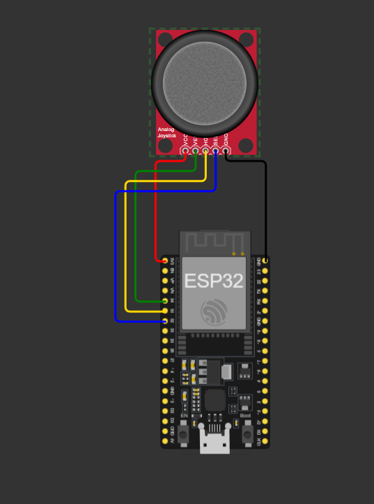

# ESP32 Single Joystick GTA V Controller

A fun project that turns a single ESP32-connected analog joystick into a virtual Xbox 360 controller for GTA V and other PC games.

The ESP32 reads joystick values and sends them over serial to Python. Python then creates a virtual Xbox controller using vgamepad and ViGEmBus, allowing Windows and GTA V to recognize it as a real game controller.

---

## Important

This project is intentionally designed around **one joystick module only**.

It is not intended to replace a full Xbox or PlayStation controller and does not provide the complete functionality of a modern gamepad.

Features such as:

* Camera control
* Multiple face buttons
* D-Pad
* Shoulder buttons
* Full trigger controls
* Dual analog sticks
* Complete controller layouts

are outside the scope of this repository.

This project exists purely as a fun experiment to see how far a single joystick and an ESP32 can be pushed.

A separate repository may be created in the future for a more complete controller implementation.

---

## Features

* ESP32 based
* Virtual Xbox 360 controller
* Analog movement
* Analog steering
* Analog acceleration and braking
* Walk Mode
* Drive Mode
* Joystick button mode switching
* Circular deadzone
* Response curves
* Input smoothing

---

## Hardware Required

* ESP32 Dev Board
* Analog Joystick Module
* Jumper Wires
* USB Cable

---

## Wiring

| Joystick Pin | ESP32 Pin |
| ------------ | --------- |
| VCC          | 3V3       |
| GND          | GND       |
| VRX          | GPIO34    |
| VRY          | GPIO35    |
| SW           | GPIO32    |

### Wiring Diagram



---

## Software Required

### Python Packages

```bash
pip install pyserial vgamepad
```

### ViGEmBus Driver

Download and install ViGEmBus:

https://github.com/nefarius/ViGEmBus/releases

Download:

```text
ViGEmBus_1.22.0_x64_x86_arm64.exe
```

Install it and reboot your PC.

---

## Upload ESP32 Firmware

Open:

```text
esp32_joystick.ino
```

in Arduino IDE.

Select:

```text
DOIT ESP32 DEVKIT V1
```

Upload the sketch.

---

## Verify ESP32 Output

Open Serial Monitor.

Baud Rate:

```text
115200
```

You should see values similar to:

```text
1650,1790,1
1647,1785,1
1655,1795,0
```

Format:

```text
X,Y,SW
```

Where:

* X = Horizontal axis
* Y = Vertical axis
* SW = Joystick button

---

## Running the Controller

Update the COM port inside:

```text
gta_xbox.py
```

Example:

```python
ser = serial.Serial("COM7", 115200, timeout=1)
```

Run:

```bash
python gta_xbox.py
```

---

## Verify Virtual Controller

Press:

```text
Win + R
```

Run:

```text
joy.cpl
```

You should see an Xbox 360 controller.

Open Properties and verify:

* Up
* Down
* Left
* Right

all respond correctly.

If the controller behaves correctly in joy.cpl, the virtual controller is working properly.

---

## GTA V Setup

### Important: Disable Steam Input

During development it was discovered that Steam Input prevented GTA V from properly recognizing the virtual controller.

Disable Steam Input before launching the game.

Steam:

```text
Library
→ Grand Theft Auto V
→ Properties
→ Controller
→ Override for Grand Theft Auto V
→ Disable Steam Input
```

Completely restart GTA V after changing this setting.

---

## Using the Controller

### Walk Mode

Default mode.

The joystick behaves like the left analog stick of an Xbox controller.

Used for:

* Walking
* Running
* Character movement

---

### Drive Mode

Press the joystick button.

The script switches to:

```text
DRIVE MODE
```

Controls become:

| Direction | Action          |
| --------- | --------------- |
| Up        | Accelerate      |
| Down      | Brake / Reverse |
| Left      | Steer Left      |
| Right     | Steer Right     |

Press the joystick button again to return to:

```text
WALK MODE
```

---

## Troubleshooting

### Controller works in joy.cpl but not in GTA V

1. Disable Steam Input.
2. Close GTA V completely.
3. Start `gta_xbox.py`.
4. Confirm the controller appears in `joy.cpl`.
5. Launch GTA V.

GTA V typically detects controllers only if they are present when the game starts.

---

### GTA V only shows keyboard prompts

Steam Input is probably still enabled.

Disable it and restart GTA V.

---

### ESP32 not detected

Check the COM port in Arduino IDE:

```text
Tools → Port
```

Update the COM port in:

```python
serial.Serial("COMx", 115200)
```

---

### Controller Drifts

Increase:

```python
DEADZONE = 3500
```

until the drift disappears.

---

## Repository Structure

```text
ESP32-Single-Joystick-GTA5-Controller/
│
├── README.md
├── esp32_joystick.ino
├── gta_xbox.py
└── image.png
```

---

## Disclaimer

This project was created for learning, experimentation and fun.

It is not intended to replace a real controller and should be viewed as a proof-of-concept demonstrating how an ESP32 can be used to emulate an Xbox controller through Python and ViGEmBus.

Controller feel, compatibility and performance will vary depending on joystick quality, calibration and game support.

---

## Future Work

Possible future improvements include:

* Dual analog sticks
* Camera control
* Face buttons
* D-Pad
* Shoulder buttons
* Trigger modules
* Full controller implementation

These features are intentionally outside the scope of this repository.

---

## License

MIT License
